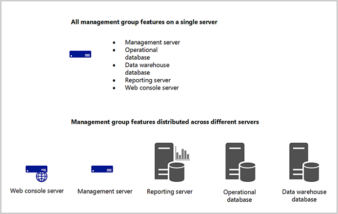
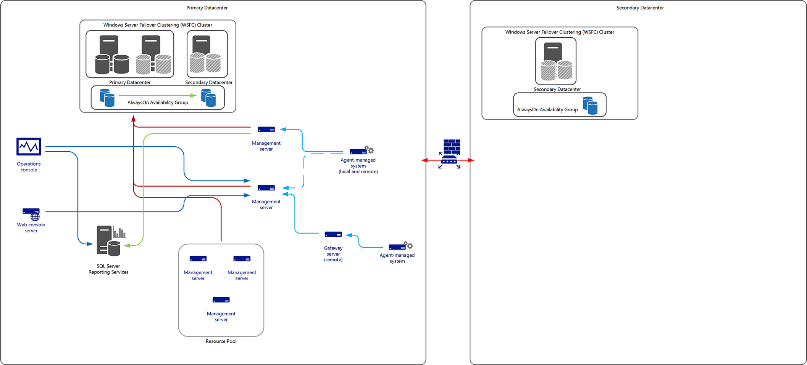

# scom
*system center operations manager*
https://learn.microsoft.com/en-us/system-center/scom


operations manager: monitor health of infrastructure

operations console: check health, performance, availability; help identify + resolve problems

---
## services
scom has 3 major services: system center management service, system center data access service (scda), system center management configuration service (sccm)
- scda: enable opsmgr access to operational database and writes data to database
- sccm: enable opsmgr access to relationships and topology of management group + distributes management packs

---
## setup and deployment

**management group (mg)**: basic unit of functionality in operations manager suite which includes:
### management servers (ms)
master admin, communicate with agents, databases

---
### consoles: operations vs. web

operations console: 
+ manage alerts & monitor data
+ manage and edit monitoring config
+ generate and view reports
+ administer management group settings
+ build customized workspaces

web console:
+ does not have full functionality of ops console
+ has access to all monitoring data and tasks on computers monitored from ops console
+ has access to *monitoring & workspace* views


---
### reporting server
builds and presents reports from data in the data warehouse database

---
### additional ms
**gateway server**: monitor untrusted domains

---
### agents
a service installed on computer, collects data, creates alert, runs responses, monitor health state, report to ms
**proxy agent**: forward data to a management server on behalf of a computer or network device

---
### databases
includes: operational database, data warehouse database, audit collection services (acs) database
- operational database (od): contains all config data & stores monitoring data collected and processed, all for management group; short-term (7 days)
- data warehouse database (dwd): is for historical purposes, stores monitoring & alerting data & always contain current data; long-term
- acs database: collects logs helpful to inspect trends and conduct security analyses

---
### system requirements
https://learn.microsoft.com/en-us/system-center/scom/system-requirements
#### hardware
lowest minimum specs: 4-core 2.66 ghz + 8 gb ram + 10 gb disk space
highest minimum specs: 8-core 2.66 ghz + 32 gb ram + 10 gb disk space
#### software: 
1. server
+ windows server 2019 standard, datacenter

2. opsmgr operational, data warehouse, acs audit database
+ [os](https://learn.microsoft.com/en-us/system-center/scom/system-requirements?view=sc-om-2022#server-operating-system)
+ [sql server](https://learn.microsoft.com/en-us/system-center/scom/plan-sqlserver-design?view=sc-om-2022#sql-server-requirements)

4. management/gateway server: 
+ powershell 2.0
+ windows remote management enabled
+ .net 4.7.2

5. web console
+ internet explorer 11
+ microsoft edge 88
+ google chrome 88
+ iis (internet information services) 7.5
+ selected site for web console with configured http or https binding
+ .net 4.7.2

6. opsmgr reporting server
+ [os](https://learn.microsoft.com/en-us/system-center/scom/system-requirements?view=sc-om-2022#server-operating-system)
+ [sql server](https://learn.microsoft.com/en-us/system-center/scom/plan-sqlserver-design?view=sc-om-2022#sql-server-requirements)
+ remote registry service: enabled and started
+ sql server reporting services
+ .net 4.7.2

7. client os
win10 or win11

8. microsoft monitoring agent 
+ .net 3.5+4.7.2 or higher
+ powershell 3.0
+ ntfs file system

10. virtualization
+ satisfy all above requirements except:
	+ there exists activities uncommitted to virtual hard drive (point-in-time snapshots, temp vhd)
	+ when any opsmgr component can't be paused or placed in 'save state'
+ system center 2016

11. supported coexistence
varies depend on scom version

12. in-place upgrade
varies depend on scom version


---
### deployment
#### requirements:
- microsoft sql server instance already exist and accessible
- sql server collation setting is a supported value
- *sql full text search* enabled
- check supported sql server versions: https://learn.microsoft.com/en-us/system-center/scom/plan-sqlserver-design?view=sc-om-2019#sql-server-requirements
- tcp/ip enabled on remote server hosting sql server database
- *sql server reporting services* installed & configured (https://learn.microsoft.com/en-us/sql/reporting-services/install-windows/install-reporting-services-native-mode-report-server)
#### single-server:
- use cases: evaluation, testing, management pack development
- environment: non-production (dev, lab, pre-production)
- services: 
	- monitoring & alerting
	- reporting (unavailable in web console)
	- audit collection
	- agent-less exception management
	- data access
- features:
	- acs collector & database
	- ops database
	- ops console
	- reporting dwd & reporting database
	- reporting server
	- web console server
	- command shell
- restricted features:
	- gateway server
	- high ava & redundancy
	- robustness & performance
- ports:
	- ops console to ms: tcp/5724
	- ops console to reporting server: tcp/80
	- web console to its server: tcp/51908
	- agent to ms: tcp/5723
	- acs forwarder to acs collector: tcp/51909
	- ms to unix/linux: tcp/1270
	- ms to unix/linux special discovery & troubleshooting: tcp/22

reference: https://learn.microsoft.com/en-us/system-center/scom/deploy-single-server
#### distributed:
- support all scom features & server roles
- install ms: 
	- graphical: https://learn.microsoft.com/en-us/system-center/scom/deploy-install-mgmt-server?view=sc-om-2019
	- terminal: run cmd as admin, navigate to opsmgr setup.exe location, execute commands:
		- to specify /UseLocalSystemActionAccount
		```powershell
		/ActionAccountUser: <domain\username> /ActionAccountPassword: <password>
		```
		- to specify /UseLocalSystemDASAccount
		```powershell
		/DASAccountUser: <domain\username> /DASAccountPassword: <password>
		```
		- to install ms
		```powershell
		setup.exe /silent /install /components:OMServer
		/ManagementGroupName: "<ManagementGroupName>"
		/SqlServerInstance: <server\instance or AG listener>
		/SqlInstancePort: <SQL instance port number>
		/DatabaseName: <OperationalDatabaseName>
		/DWSqlServerInstance: <server\instance or AG listener>
		/DWSqlInstancePort: <SQL instance port number>
		/DWDatabaseName: <DWDatabaseName>
		/UseLocalSystemActionAccount /UseLocalSystemDASAccount
		/DatareaderUser: <domain\username>
		/DatareaderPassword: <password>
		/DataWriterUser: <domain\username>
		/DataWriterPassword: <password>
		/EnableErrorReporting: [Never|Queued|Always]
		/SendCEIPReports: [0|1]
		/UseMicrosoftUpdate: [0|1]
		/AcceptEndUserLicenseAgreement: [0|1]
		```
	- (optional) additional ms
		```powershell
		setup.exe /silent /install /components:OMServer
		/SqlServerInstance: <server\instance or AG listener>
		/SqlInstancePort: <SQL instance port number>
		/DatabaseName: <OperationalDatabaseName>
		/UseLocalSystemActionAccount /UseLocalSystemDASAccount
		/DataReaderUser: <domain\username>
		/DataReaderPassword: <password>
		/DataWriterUser: <domain\username>
		/DataWriterPassword: <password>
		/EnableErrorReporting: [Never|Queued|Always]
		/SendCEIPReports: [0|1]
		/UseMicrosoftUpdate: [0|1]
		```

---
### running services on management server


---
### resource pools
- 3 members = high availability
- high availability: no loss of monitoring when a member is unavailable
- quorum algorithm: more than 50% of members available to maintain high availability
- roles:
	- members: management server(ms) or gateway server (gs)
	- observers: same as members, no workflows participation, yes quorum decisions participation, rarely used 
	- default observer (deob): opsmgr database, enabled by default, allow high availability for pools with less than 3 members
- scenarios:
	- management server:
		- single ms: no high availability, single point of failure, deob gives no benefit
		- 2 ms: high availability, lose highava if disable deob
		- 3 ms: highava, can only have max 1 ms down, deob gives no value
		- 4 ms: highava, max 2 ms down => deob has great value
		- ≥5 ms: highava, deob has no value => should be removed
	- gateway server:
		- use cases: local agentless coms across small wan circuit, monitor unix/linux servers in a firewalled off dmz (de-militarized zone)
		- deob should not be used because gateways do not have local sdk services => cannot query database
	- 2 gs + 1 observer:
		- rare cases with specific firewall rules need workaround
		- requires tcp_57523 opened for health service coms
	- agents-only:
		- possible but not officially supported by microsoft (supports only ms and gateways)
		- can only be set up via terminal (powershell)
reference: [Understanding SCOM Resource Pools – Kevin Holman's Blog](https://kevinholman.com/2016/11/21/understanding-scom-resource-pools/)

- how to remove a resource pool member: opsmgr > administration > resource pools > tasks > **manual membership** > pool membership > delete
- how to return resource pool to automatic membership: 
	```powershell
	Get-SCOMResourcePool -DisplayName "Resource Pool Name" | Set-SCOMResourcePool -EnableAutomaticMembership 1
	```
	replace "resource pool name" with actual pool name

---
### disaster recovery
- protect from system failure, system loss
- not optimized for accidental, unintended, malicious data loss or corruption
- example operations to restore: low-priority reporting database, analysis data
- multisite dr at system/application level expense is much greater than data's value in many cases 
- recovery point objective (rpo): tolerance of extent of monitoring data loss
- recovery time objective (rto): level of complexity and expense
	- 2 common dr options:
		- duplication: similar in scale and configuration to primary mg, no tolerance for downtime, most complex, includes integration with itsm platforms (scsm, remedy, servicenow, etc.), data duplication
		- secondary deployment: in cold-standby config, no participation in mg until dr is triggered
		- ![[Pasted image 20240118154632.png]]
	- alternatives:
		- deploy additional mg components: to retain functionalities of mg, minimum implementation: sql server 2014/2016 always on availability group for operational & data warehouse databases, two-node failover cluster instance (FCI) in primary datacenter, standalone sql server  in secondary datacenter as part of wsfc (windows server failover cluster)
		- azure virtual machine: require sql server, set up configurations as described above


---
### complete setup process
1. domain controller (dc): create admin users (and optionally backup admin users) and add them all to a group (om administrator security group)
2. dc: add om administrators security group to builtin administrators group
3. (sql) server: add om administrators security group to local administrators group
4. sql: turn off firewall for domain networks
5. sql: install sql 2019 (developer edition), 
6. sql: install sql latest cumulative update
7. sql: install sql server reporting services
8. sql: install ssms
9. management server (ms): add om administrators security group to local administrators group
10. ms: install sqlsysclrtypes 2014
11. ms: install reportviewer 2015
12. ms: run powershell command to activate iis
13. ms: install scom 2019 management server + operations console + web console
14. sql: install scom 2019 reporting server

reference: [SCOM 2019 – QuickStart Deployment Guide – Kevin Holman's Blog](https://kevinholman.com/2019/03/14/scom-2019-quickstart-deployment-guide)

---
## operations and web consoles

### how to connect to operations and web console

#### what if client cannot connect to console?
1. check health service: windows + r > services.msc > microsoft monitoring agent (health service) > double-click open properties panel > set *startup* type to *automatic* > click *start* if **service status** is not **started**
2. check antivirus exclusions: 
- exclusions by process executable: MonitoringHost.exe, HealthService.exe, MOMPerfSnapshotHelper.exe, Microsoft.Mom.Sdk.ServiceHost.exe, cshost.exe
- exclusions by directories: 
- exclusions of file type by extension: 
3. check network issues:
- agent computer must connect to tcp:5723
- ports must be enabled: tcp&udp :389 for ldap; tcp&udp :88 for kerberos authentication; tcp&udp :53 for dns
- rpc communications complete successfully
- netsh int ipv4 show dynamic

---
### exploring operations and web consoles


---
### run web console server on standalone server
`hostname` _#_ print server name
`http://[server name]/operationsmanager` _#_ open web console to hosting server

---
## security

### ports 


---
### antivirus exclusions


---
### accounts and permissions during installation


---
### configure SPNs


---
### run-as accounts and profiles


---
### user roles


---
### TLS 1.2
**back up registry before edit**
- should be enabled for all incoming/outcoming coms
- 2 methods to configure system to only use tls 1.2 protocol: manual and automatic registry modification
- for windows os:
	- manual: 
		1. windows run `regedit` 
		2. locate registry subkey `HKEY_LOCAL_MACHINE\System\CurrentControlSet\Control\SecurityProviders\SCHANNEL\Protocols` 
		3. create **Protocols** subkey for ssl 2.0, ssl 3.0, tls 1.0, tls 1.1, tls 1.2
		4. create client and server subkey under each protocol
		5. create DWORD values under each protocol to enable/disable them: 
			- **Enabled** [Value = 0]
		    - **DisabledByDefault** [Value = 1]
		    - or
			- **Enabled** [Value = 1]
		    - **DisabledByDefault** [Value = 0]
	- automatic:
		```powershell
		$ProtocolList       = @("SSL 2.0", "SSL 3.0", "TLS 1.0", "TLS 1.1", "TLS 1.2")
		$ProtocolSubKeyList = @("Client", "Server")
		$DisabledByDefault  = "DisabledByDefault"
		$registryPath       = "HKLM:\SYSTEM\CurrentControlSet\Control\SecurityProviders\SCHANNEL\Protocols\"
		
		foreach ($Protocol in $ProtocolList)
		{
			foreach ($key in $ProtocolSubKeyList)
			{
				$currentRegPath = $registryPath + $Protocol + "\" + $key
				Write-Output "Current Registry Path: `"$currentRegPath`""
		
				if (!(Test-Path $currentRegPath))
				{
					Write-Output " `'$key`' not found: Creating new Registry Key"
					New-Item -Path $currentRegPath -Force | out-Null
				}
				if ($Protocol -eq "TLS 1.2")
				{
					Write-Output " Enabling - TLS 1.2"
					New-ItemProperty -Path $currentRegPath -Name $DisabledByDefault -Value "0" -PropertyType DWORD -Force | Out-Null
					New-ItemProperty -Path $currentRegPath -Name 'Enabled' -Value "1" -PropertyType DWORD -Force | Out-Null
				}
				else
				{
					Write-Output " Disabling - $Protocol"
					New-ItemProperty -Path $currentRegPath -Name $DisabledByDefault -Value "1" -PropertyType DWORD -Force | Out-Null
					New-ItemProperty -Path $currentRegPath -Name 'Enabled' -Value "0" -PropertyType DWORD -Force | Out-Null
				}
				Write-Output " "
			}
		}
		```
- for operations manager:
	- manual:
		1. windows run `regedit`
		2. locate subkey `HKEY_LOCAL_MACHINE\SOFTWARE\Microsoft\.NETFramework\v4.0.30319`
		3. DWORD value **SchUseStrongCrypto** with value **1**
		4. locate subkey `HKEY_LOCAL_MACHINE\SOFTWARE\WOW6432Node\Microsoft\.NETFramework\v4.0.30319`
		5. DWORD value **SchUseStrongCrypto** with value **1**
		6. restart system
	- automatic:
		```powershell
		# Tighten up the .NET Framework
		$NetRegistryPath = "HKLM:\SOFTWARE\Microsoft\.NETFramework\v4.0.30319"
		New-ItemProperty -Path $NetRegistryPath -Name "SchUseStrongCrypto" -Value "1" -PropertyType DWORD -Force | Out-Null
		
		$NetRegistryPath = "HKLM:\SOFTWARE\WOW6432Node\Microsoft\.NETFramework\v4.0.30319"
		New-ItemProperty -Path $NetRegistryPath -Name "SchUseStrongCrypto" -Value "1" -PropertyType DWORD -Force | Out-Null
		```
- acs (audit collection services): update **dsn** settings on acs collector server for tls 1.2 to work because acs uses dsn to connect to db
	1. windows run `regedit`
	2. locate subkey `HKEY_LOCAL_MACHINE\SOFTWARE\ODBC\ODBC.INI\OpsMgrAC`
	3. change dsn named "OpsMgrAC" to "ODBC Driver 17 for SQL Server"
	4. change driver entry to `%WINDIR%\system32\msodbcsql17.dll`
	- alternative methods: 
		1. create new .reg file and execute it, file name: ODBC 17.reg
		```powershell
			Windows Registry Editor Version 5.00
		
		[HKEY_LOCAL_MACHINE\SOFTWARE\ODBC\ODBC.INI\ODBC Data Sources]
		"OpsMgrAC"="ODBC Driver 17 for SQL Server"
		
		[HKEY_LOCAL_MACHINE\SOFTWARE\ODBC\ODBC.INI\OpsMgrAC]
		"Driver"="%WINDIR%\system32\msodbcsql17.dll"
		```
		2. terminal commands:
		```powershell
		New-ItemProperty -Path "HKLM:\SOFTWARE\ODBC\ODBC.INI\OpsMgrAC" -Name "Driver" -Value "%WINDIR%\system32\msodbcsql7.dll" -PropertyType STRING -Force | Out-Null
		New-ItemProperty -Path "HKLM:\SOFTWARE\ODBC\ODBC.INI\ODBC Data Sources" -Name "OpsMgrAC" -Value "ODBC Driver 17 for SQL Server" -PropertyType STRING -Force | Out-Null
		```
reference: [Implement TLS 1.2 for Operations Manager | Microsoft Learn](https://learn.microsoft.com/en-us/system-center/scom/plan-security-tls12-config?view=sc-om-2019)


---
---
## Gateway and workgroup servers
### configure certificate for workgroup/gateway server
1. dc: add active directory certificate services: 
![[Pasted image 20240119163517.png]]
2. select "certificate enrollment web service" and "certificate authority web enrollment" role services
![[Pasted image 20240119163455.png]]
3. ad cs configuration: install "certification authority" before installing "certification authority web enrollment" and certificate enrollment web service"
![[Pasted image 20240119181916.png]]
- successful installation:
![[Pasted image 20240119182011.png]]


## OMS vs. OM
- oms is suitable when beginning to extend a small single-server network
- oms is meant to compliment and extend what om can do for parge enterprise environments, not to replace
- oms can be used independently to provide log analytics and monitoring controls for small and medium-sized environments with multi-server data centers/deployments 
- does not require systems center
- cloud-based management solution for on-prem servers & PM 
- OMS tools:
	- Solution Paths
	- Active Directory
	- Active Directory Assessments
	- Replication Health
	- Upgrade Readiness

---
## terminal commands

Activate IIS on ms:
```powershell
Add-WindowsFeature NET-WCF-HTTP-Activation45,Web-Static-Content,Web-Default-Doc,Web-Dir-Browsing,Web-Http-Errors,Web-Http-Logging,Web-Request-Monitor,Web-Filtering,Web-Stat-Compression,Web-Mgmt-Console,Web-Metabase,Web-Asp-Net,Web-Windows-Auth –Restart
```
get-scomgroup _#_ print scom groups
`setspn -l [domain]\[server name]` _#_ list registered spns 
`Get-SCOMResourcePool -DisplayName "Resource Pool Name" | Set-SCOMResourcePool -EnableAutomaticMembership 1` _#_ set resource pool membership type to automatic
get-windowsfeature -computername [hostname] | where installed _#_ list installed features


# ---
# scsm
*system center service manager*
6 major parts: service manager management server, server manager database, data warehouse management server, data warehouse databases and service manager console
3 required accounts: management group administrators, service manager services account and workflow account
3-tiered application consist of a database, a data access module and a console


# ---
# orchestrator
*system center orchestrator* 
- is an automation tool
- automate Windows Azure operations related to certificates, deployments, cloud services, storage, and virtual machines
- support virtualization
- installation prerequisites:
	- microsoft sql server 2016/2017
	- iis (internet information services)
	- .net 3.5 service pack 1
	- .net 4
	- microsoft sql server 2012 native client
- types of codes to run tasks: 
	- platform code: shared among activities to run common tasks, generate *common published data*
	- domain code: run tasks specific to each activity


reference: [Overview of Orchestrator Console | Microsoft Learn](https://learn.microsoft.com/en-us/system-center/orchestrator/console-overview)
# ---
# interview 
## what is scom?
scom - system center operation manager, is a crucial service within the microsoft system center suite providing infrastructure monitoring that is flexible and cost-effective, helps ensure the predictable performance and availability of vital applications, and offers comprehensive monitoring for datacenter and cloud, both private and public

## what is management group in scom? how does it work?
management group is a basic unit of functionality of operation manager, at minimum it consists of a *management server*, *operational database* and *reporting data warehouse database* (and an additional *reporting server* if reporting functionality is installed)

## services of scom? (verbose details)
services within scom are: management servers, agents, management packs, services (microsoft monitoring agent), 

## what is resource pooling in scom? how does it work?
resource pool is an pool consists of multiple management servers  spreading workloads across these servers; 
- newly added management servers are assigned some of the work from existing servers; 
- each member will manage a distinct set of remote objects 
- no 2 members of the same resource pool will manage the same object at the same time

## what if client cannot connect to console?
1. check health service: windows + r > services.msc > microsoft monitoring agent (health service) > double-click open properties panel > set *startup* type to *automatic* > click *start* if **service status** is not **started**
2. check antivirus exclusions: 
- exclusions by process executable: MonitoringHost.exe, HealthService.exe, MOMPerfSnapshotHelper.exe, Microsoft.Mom.Sdk.ServiceHost.exe, cshost.exe
- exclusions by directories: 
- exclusions of file type by extension: 
3. check network issues:
- agent computer must connect to tcp:5723
- ports must be enabled: tcp&udp :389 for ldap; tcp&udp :88 for kerberos authentication; tcp&udp :53 for dns
- rpc communications complete successfully
- netsh int ipv4 show dynamic

reference: https://learn.microsoft.com/en-us/troubleshoot/system-center/scom/troubleshoot-agent-connectivity-issues
## differences between operational database and data warehouse?
operational database (od) vs data warehouse database (dwd): 
od contains all config data & stores monitoring data collected and processed, all for management group; short-term (7 days)
dwd is for historical purposes, stores monitoring & alerting data & always contain current data; long-term

## difference between rules and monitoring?
rules: defines the events and performance data to collect from computers and what to do with the information after collected, simply understand, it's if/then statement
monitors: define health state for particular aspects of the monitored object; can be configured to generate an laert when a state change occurs

## reporting server


## gateway server
gateway server: enables the monitoring of computers in untrusted domains

## proxy agent vs regular agent
agentless monitoring: a proxy (remote) agent is an agent that can forward data to a management server on behalf of a computer or network device other than its host computer; 
agent monitoring: 

# ---
# troubleshoots
## Failed to connect to server, the data access service is either not running or not yet initialized

![[Pasted image 20240115114807.png]]
- error log:
	```powershell
	Date: 1/15/2024 4:42:38 AM
	Application: Operations Manager
	Application Version: 10.19.10050.0
	Severity: Error
	Message: Failed to connect to server 'MS.VANLE.lab'
	
	Microsoft.EnterpriseManagement.Common.ServiceNotRunningException: The Data Access service is either not running or not yet initialized. Check the event log for more information. ---> System.ServiceModel.EndpointNotFoundException: Could not connect to net.tcp://ms.vanle.lab:5724/DispatcherService. The connection attempt lasted for a time span of 00:00:02.0030047. TCP error code 10061: No connection could be made because the target machine actively refused it 10.96.136.6:5724.  ---> System.Net.Sockets.SocketException: No connection could be made because the target machine actively refused it 10.96.136.6:5724
	   at System.Net.Sockets.Socket.DoConnect(EndPoint endPointSnapshot, SocketAddress socketAddress)
	   at System.Net.Sockets.Socket.Connect(EndPoint remoteEP)
	   at System.ServiceModel.Channels.SocketConnectionInitiator.Connect(Uri uri, TimeSpan timeout)
	   --- End of inner exception stack trace ---
	
	Server stack trace: 
	   at System.ServiceModel.Channels.SocketConnectionInitiator.Connect(Uri uri, TimeSpan timeout)
	   at System.ServiceModel.Channels.BufferedConnectionInitiator.Connect(Uri uri, TimeSpan timeout)
	   at System.ServiceModel.Channels.ConnectionPoolHelper.EstablishConnection(TimeSpan timeout)
	   at System.ServiceModel.Channels.ClientFramingDuplexSessionChannel.OnOpen(TimeSpan timeout)
	   at System.ServiceModel.Channels.CommunicationObject.Open(TimeSpan timeout)
	   at System.ServiceModel.Channels.LayeredChannel`1.OnOpen(TimeSpan timeout)
	   at System.ServiceModel.Channels.CommunicationObject.Open(TimeSpan timeout)
	   at System.ServiceModel.Channels.ServiceChannel.OnOpen(TimeSpan timeout)
	   at System.ServiceModel.Channels.CommunicationObject.Open(TimeSpan timeout)
	   at System.ServiceModel.Channels.ServiceChannel.CallOpenOnce.System.ServiceModel.Channels.ServiceChannel.ICallOnce.Call(ServiceChannel channel, TimeSpan timeout)
	   at System.ServiceModel.Channels.ServiceChannel.CallOnceManager.CallOnce(TimeSpan timeout, CallOnceManager cascade)
	   at System.ServiceModel.Channels.ServiceChannel.EnsureOpened(TimeSpan timeout)
	   at System.ServiceModel.Channels.ServiceChannel.Call(String action, Boolean oneway, ProxyOperationRuntime operation, Object[] ins, Object[] outs, TimeSpan timeout)
	   at System.ServiceModel.Channels.ServiceChannelProxy.InvokeService(IMethodCallMessage methodCall, ProxyOperationRuntime operation)
	   at System.ServiceModel.Channels.ServiceChannelProxy.Invoke(IMessage message)
	
	Exception rethrown at [0]: 
	   at System.Runtime.Remoting.Proxies.RealProxy.HandleReturnMessage(IMessage reqMsg, IMessage retMsg)
	   at System.Runtime.Remoting.Proxies.RealProxy.PrivateInvoke(MessageData& msgData, Int32 type)
	   at Microsoft.EnterpriseManagement.Common.Internal.IDispatcherService.Connect(SdkClientConnectionOptions connectionOptions)
	   at Microsoft.EnterpriseManagement.Common.Internal.SdkDataLayerProxyCore.Initialize(EnterpriseManagementConnectionSettings connectionSettings, SdkChannelObject`1 channelObjectDispatcherService)
	   at Microsoft.EnterpriseManagement.Common.Internal.SdkDataLayerProxyCore.CreateEndpoint[T](EnterpriseManagementConnectionSettings connectionSettings, SdkChannelObject`1 channelObjectDispatcherService)
	   --- End of inner exception stack trace ---
	   at Microsoft.EnterpriseManagement.Common.Internal.ExceptionHandlers.HandleChannelExceptions(Exception ex)
	   at Microsoft.EnterpriseManagement.Common.Internal.SdkDataLayerProxyCore.CreateEndpoint[T](EnterpriseManagementConnectionSettings connectionSettings, SdkChannelObject`1 channelObjectDispatcherService)
	   at Microsoft.EnterpriseManagement.Common.Internal.SdkDataLayerProxyCore.ConstructEnterpriseManagementGroupInternal[T,P](EnterpriseManagementConnectionSettings connectionSettings, ClientDataAccessCore clientCallback)
	   at Microsoft.EnterpriseManagement.Common.Internal.SdkDataLayerProxyCore.RetrieveEnterpriseManagementGroupInternal[T,P
	```